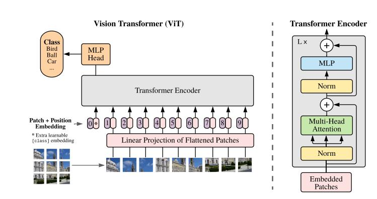

# AN IMAGE IS WORTH 16X16 WORDS: TRANSFORMERS FOR IMAGE RECOGNITION AT SCALE

## Introduction

This paper aims to build a transformer for CV usage. We all know that transformer and attention mechanism work well in NLP field, this paper would like to 'borrow' the exactually
same model from NLP. As it said in the paper, there are many high-efficiency implements in NLP field, so it would be great process if we can copy their idea. Previously, there are
multiple paper illustrate their idea about adding attention in CV tasks. However, all of these models on some level apply inductive bias whereas in this paper, the author want to minimize
this bias.

## Net Structure

